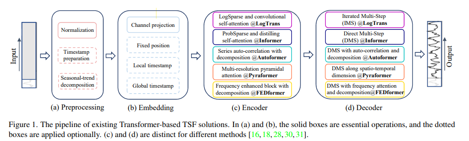

# Are Transformers Effective for Time Series Forecasting
时间关系，attention导致了时间信息的丢失`permutation invariant and “anti-order”`

引入**LTSF-Linear**：单层的线性模型，对历史信息回归，更好的baseline？

## Transformer-Based LTSF Solutions
- 原始：二次时间/内存复杂度，自回归解码器设计引起误差累积。
- Informer：降复杂度，DMS（direc multi-step，直接预测多步）预测。
- ……

### 现存架构形式

#### Time series decomposition
数据预处理
- normalization with zero-mean
- 季节趋势 moving average kernel

#### Input embedding
self-attention层无法保留时间序列的位置信息（局部位置信息、全局的时间信息，如分层的时间戳(周、月、年)和不可知的时间戳(节假日和事件)）。

injecting several embeddings
如固定位置编码、通道投影嵌入和可学习的时间嵌入。

此外，引入时间卷积层或可学习时间戳的时间嵌入。

#### Self-attention
Transformers rely on the self-attention mechanism to extract the semantic dependencies between paired elements.

二次级的开销，用一些方法降低复杂度

#### Decoder
传统：自回归的方式输出序列，导致推理速度慢和误差累积效应

>Transformer模型的前提是成对**元素之间的语义相关关系**，而自注意力机制本身是**排列不变**的，其建模时序关系的能力在很大程度上取决于与输入token相关的位置编码。
>
>考虑到时间序列中的原始数值数据(例如，股票价格或电力值)，它们之间几乎不存在任何按点的语义相关性。在时间序列建模中，我们**主要感兴趣的是连续点集之间的时间关系，而这些元素的顺序而不是成对关系起着最关键的作用**。虽然采用位置编码和使用token嵌入子序列有利于保留一些排序信息，但排列不变的自注意力机制的性质不可避免地导致了**时间信息的丢失**。

## LTSF-Linear
通过加权和操作直接回归历史时间序列，用于预测

basic formulation：
$$
\hat{X_i}=WX_i
$$

$W\in \mathbb{R}^{T\times L}$由历史$L$步预测未来$T$步

用不同方法预处理： DLinear and NLinear.
- DLinear
  - when there is a clear trend in the data
- NLinear
  - when there is a distribution shift in the dataset

## Appendix
部分TSF解法

LTSF-Linear的特征、优势