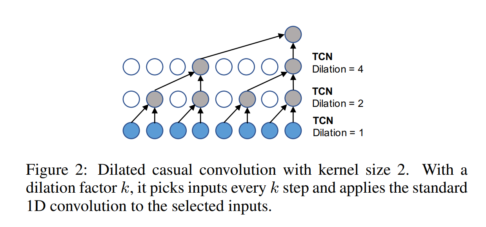
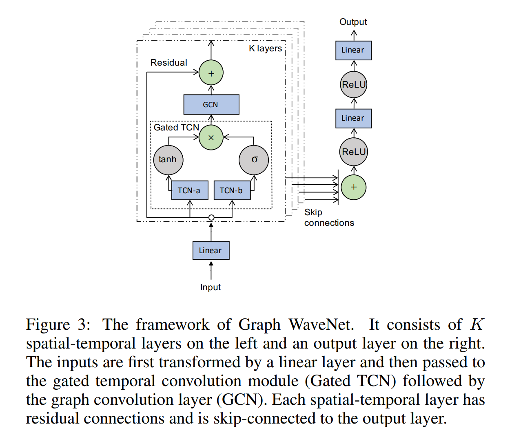

# Graph WaveNet for Deep Spatial-Temporal Graph Modeling
源代码：https://github.com/nnzhan/Graph-WaveNet

显式图结构不一定反映真实依赖关系。

使用rnn和cnn不能捕捉长程时间序列。

- graph neural network
architecture
- 时空图建模（复杂系统）
  - 将数据图结构引入模型
  - 基本假设：一个节点的未来信息是以其历史信息以及其邻居的历史信息为条件的。
  - 连接结点反映好依赖关系？时间依赖的学习效果问题。

## contribution
construct a **self-adaptive adjacency matrix** which preserves **hidden spatial dependencies**.能够在没有任何先验知识指导的情况下，从数据中自动发现未见的图结构。

effective and efficient **framework** to capture **spatial-temporal dependencies** simultaneously.

## 图卷积层(GCN)
提取结点特征，捕捉**空间**依赖关系

diffusion convolution layer
用K个有限步对图信号的扩散过程进行建模
$$
Z=\sum_{k=0}^{K}P^kXW_k
$$

- $P^k$:转移矩阵的幂级数
  - 无向图 $P = A/rowsum(A)$
  - 有向图：分正向 $P = A/rowsum(A)$ 反向 $P = A^T/rowsum(A^T)$

### Self-adaptive Adjacency Matrix
不需要任何先验知识，通过**随机梯度下降**进行端到端的学习，模型自行提取隐藏的空间依赖性

$E_1,E_2\in R^{N\times c}$为可学习的参数。name E1 as the source node embedding and E2 as the target node embedding. 两者相乘退出源节点和目标节点间的空间依赖权重。

$$
\tilde{\mathbf{A}}_{adp}=SoftMax(ReLU(\mathbf{E}_1\mathbf{E}_2^\mathsf{T}))\\
\mathbf{E}_1,\mathbf{E}_2\in\R^{N\times c}
$$

图卷积层：
$$
Z=\sum_{k=0}^{K}P_f^kXW_{k1}+P_b^kXW_{k2}+\tilde{\mathbf{A}}_{adp}XW_{k3}
$$

单独使用自适应邻接矩阵来捕获隐藏的空间依赖关系:
$$
Z=\sum_{k=0}^{K}\tilde{\mathbf{A}}_{adp}XW_{k}
$$
## 时间卷积层(TCN)
dilated causal convolution捕获节点的时间趋势。（取代原来的cnn）

- 通过增加层数，允许一个指数级的感受野
- 以非递归的方式正确处理长程序列，这有利于并行计算，并缓解梯度爆炸问题。

过向输入填充零来**保留时间上的因果顺序**，这样在当前时间步上所做的预测只涉及历史信息。卷积操作通过**跳过具有一定步长的值**在输入上滑动。

顺序堆叠->感受野指数级增长->够用更少的层捕获更长的序列，节省了计算资源

Gated TCN门控机制
## 框架

-  stacked spatial-temporal layers 堆K层，**每层有残差连接**，并**与输出层有跳跃式连接**。在底层，GCN接收短期时间信息，而在顶层，GCN处理长期时间信息。（长短期记忆？从结构设计上没感觉到？）
   -  GCN
   -  Gated TCN（两个并行的TCN构成）
-  an output
layer
