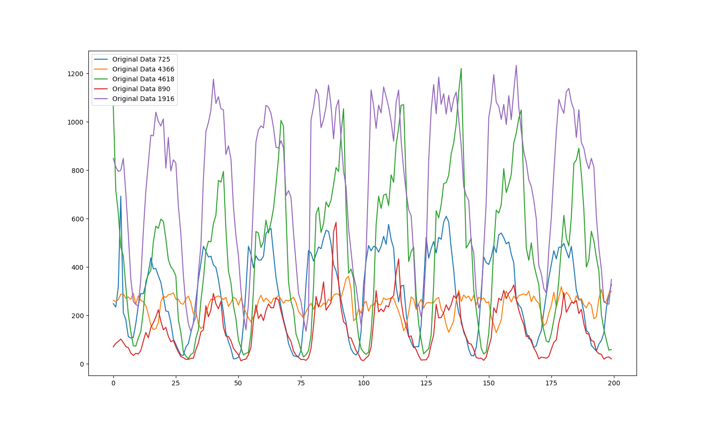
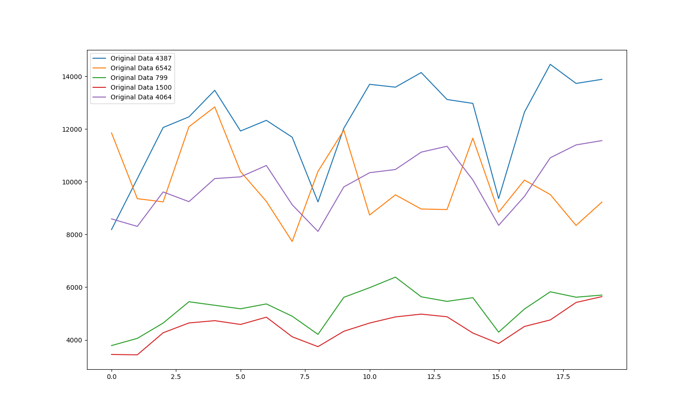
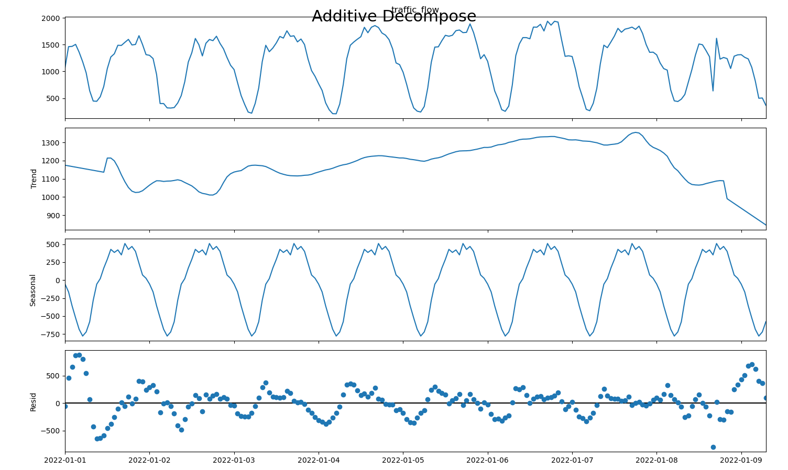
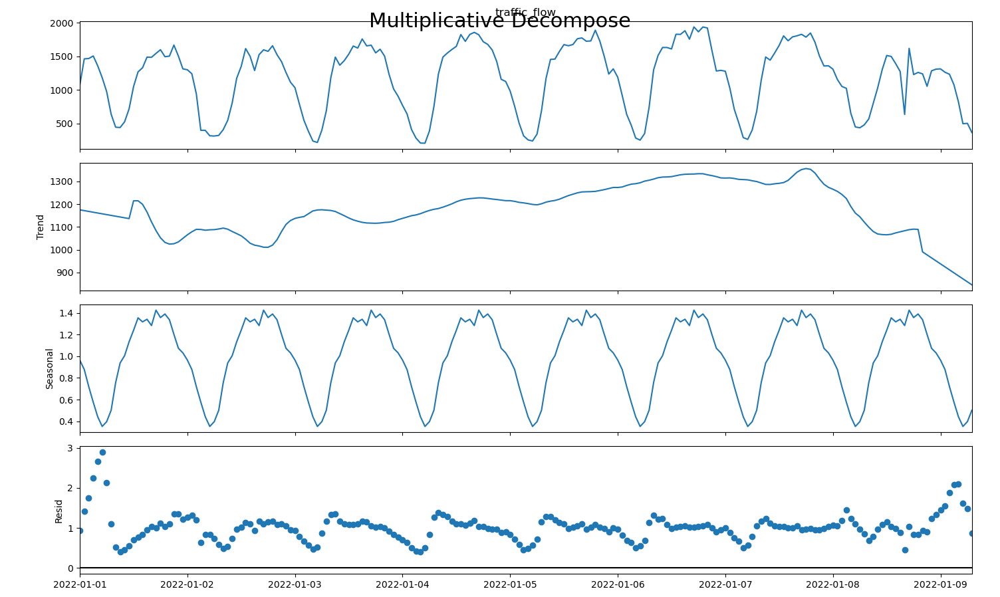

# Time Series Analysis
[link](https://www.machinelearningplus.com/time-series/time-series-analysis-python/)

## Plot of a Time Series
时间序列有一定变化趋势，对交通流量显然有明显日周期趋势
hourly time series and follows a certain repetitive pattern every day


对日流量求和，发现有按星期的变化趋势

**(todo:月变化趋势？初步来看并不显著)**

Any time series may be split into the following components:
- Base Level
- Trend
- Seasonality
- Error

## 时间序列分解
$$
TimeSeries= F(Base Level, Trend , Seasonality , Error)
$$
可以将$F$建模为加性、乘性（或其他更复杂的变化形式）

*期望在预处理过程中将时间序列的成分做一个更好的分解？*

以下为对单点的数据（以小时为粒度，取前200小时，缺省值用邻近值补位）做乘性和加性分解使得结果



简单分析结果是乘性模型分解更好。*这里暂时仅考虑了每天的周期性，从trend中大概能感觉出还有一个按周的周期性，考虑对周信息也做类似操作？*

# ARIMA(AutoRegressive Integrated Moving Average)
[link](https://www.machinelearningplus.com/time-series/arima-model-time-series-forecasting-python/)

basic idea: the information in the past values of the time series can alone be used to predict the future values

for **non-seasonal** time series.
for seasonal time series, we need to add seasonal terms.

## terms
```python
# p: the order of the AR term. 自回归部分的阶数，表示模型中考虑的过去时间步的数量
# d: the number of differencing required to make the time series stationary. 差分的阶数，表示对原始时间序列进行差分的次数，使其平稳
# q: the order of the MA term. 滑动平均部分的阶数，表示模型中考虑的预测误差的数量
ARIMA(p=10, d=1, q=8)
```

Predicted Yt = Constant + Linear combination Lags of Y (upto p lags) + Linear Combination of Lagged forecast errors (upto q lags)
$$
Y_t=c+(\beta_1Y_{t-1}+\beta_2Y_{t-2}+\cdots+\beta_pY_{t-p})+(\theta_1\epsilon_{t-1}+\theta_2\epsilon_{t-2}+\cdots+\theta_q\epsilon_{t-q})+\epsilon_t
$$

simple usage: `from statsmodels.tsa.arima_model import ARIMA`


### AR(Auto Regressive)
linear regressive model

$$
Y_t=\alpha_{ar}+\beta_1Y_{t-1}+\beta_2Y_{t-2}+\cdots+\beta_pY_{t-p}+\epsilon
$$

### I(Integrated)
对原始时间序列做差分处理。

差分可以消除时间序列的季节性和趋势，使得模型更容易建立和预测。

### MA(Moving Average)
滑动平均部分，指模型使用过去时间步的预测误差来预测未来时间步的观测值。MA 模型中的滑动平均项表示当前观测值与前几个预测误差之间的线性关系。

